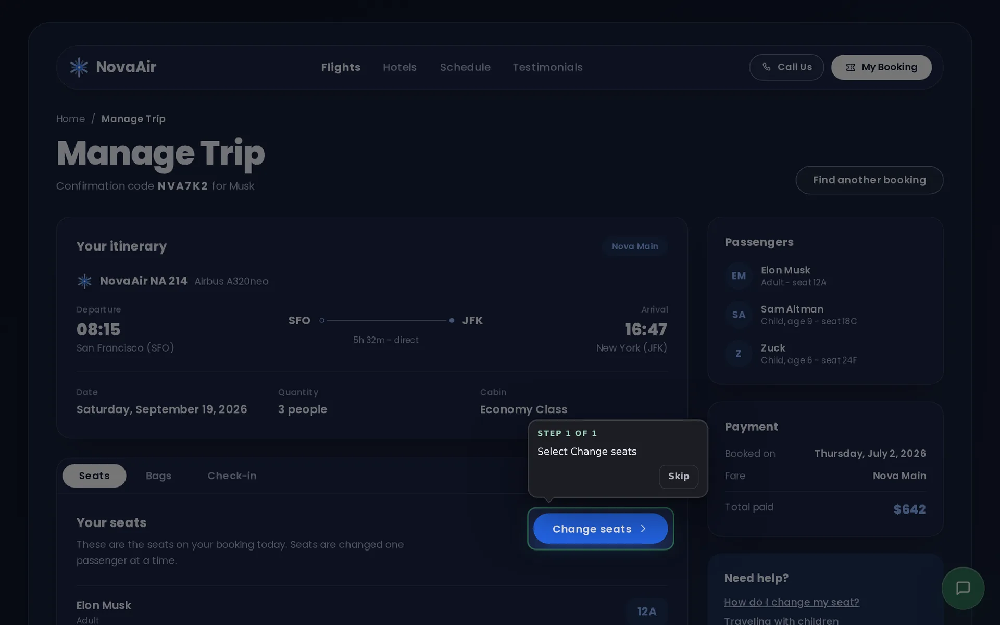
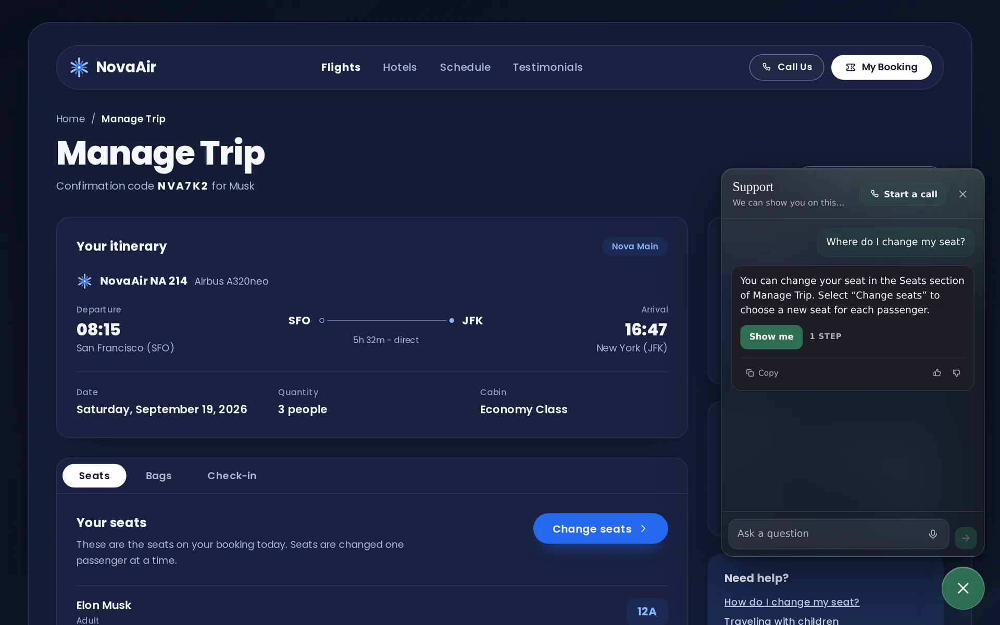
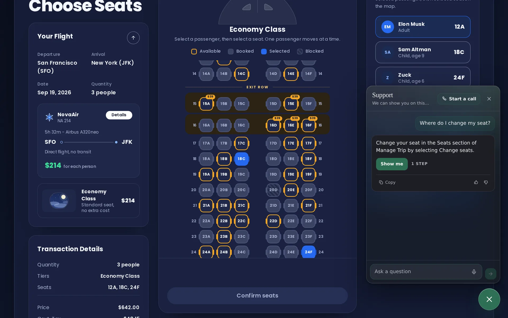
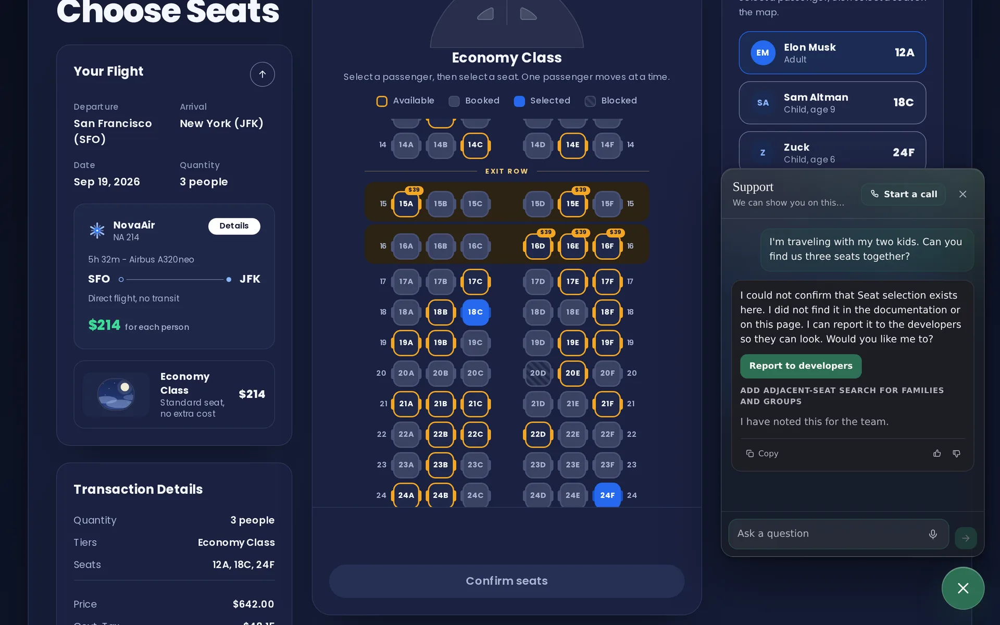
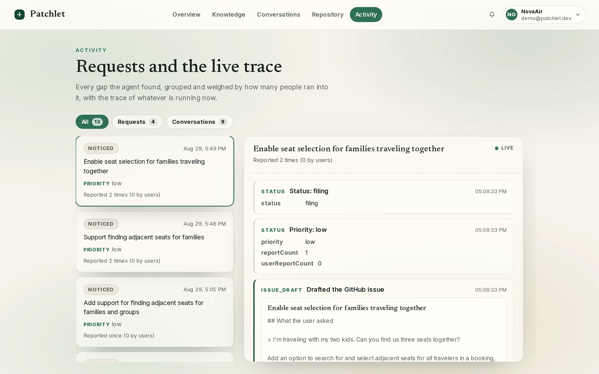
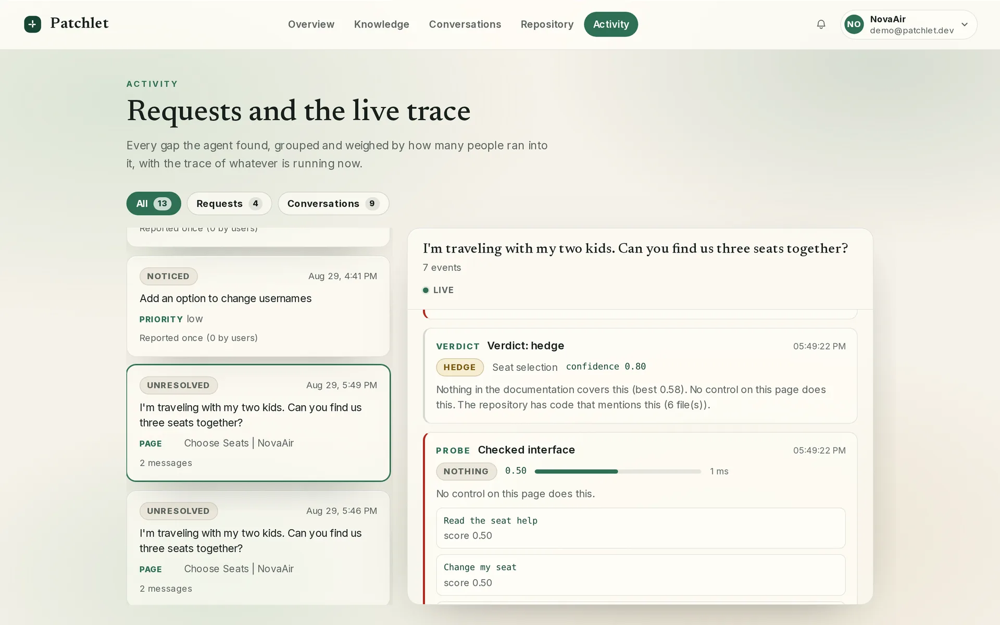
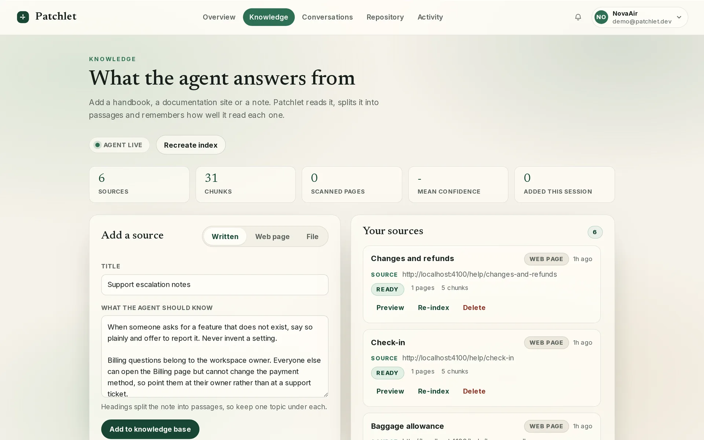
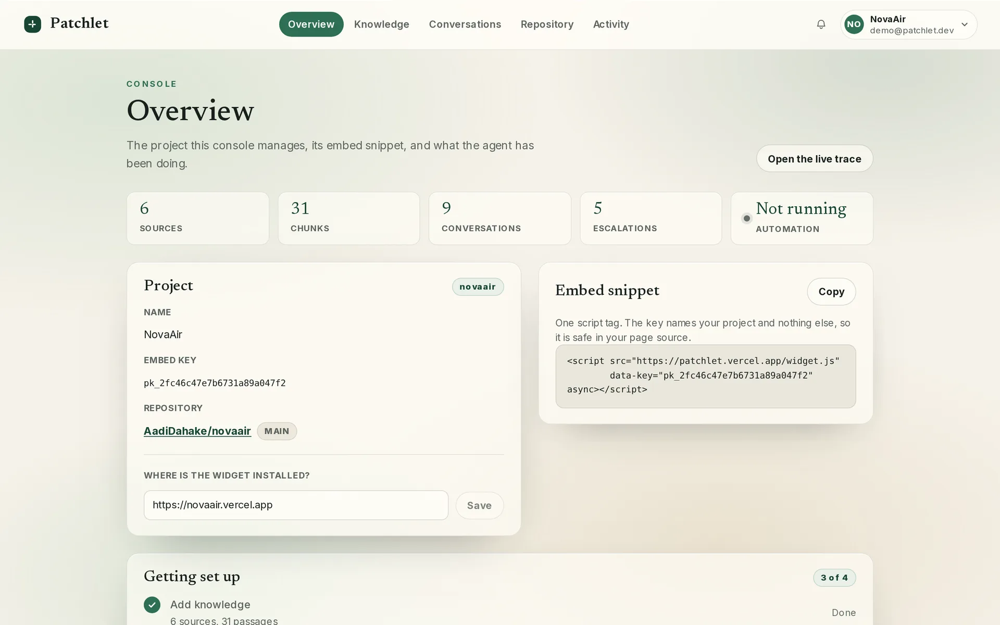

<div align="center">

# Patchlet

**Patchlet turns repeated customer workarounds into verified product PRs.**

[](https://github.com/AadiDahake/patchlet_codex_hackathon/actions/workflows/ci.yml)

**[Try the live demo](https://novaair.vercel.app)** &nbsp;·&nbsp; **[Open the console](https://patchlet.vercel.app)** &nbsp;·&nbsp; [The plan](docs/PLAN.md) &nbsp;·&nbsp; [Architecture](docs/architecture.md)

NovaAir is the host product. Open **My Booking**, use confirmation code `NVA7K2` and last name `Musk`, and the
widget is in the corner of the page.



</div>

## What it does

**It shows the user on their own screen.** A company drops one script tag into its product. The widget reads the
page it is sitting on, sends the agent opaque handles for the controls it found, and the agent answers from the
company's own documentation. The answer comes back with a step plan, and the widget spotlights the real control on
the user's own screen. The route is planned over a map of the product, so the step count is right from the first
step and stays right across a navigation. A plan that names a control the widget did not send is thrown away
whole.

**It proves a feature is missing before it says so.** Three checks run at once: the help documentation, the
interface in front of the user, and the connected repository. A documentation or interface hit answers the
question. Only when all three come back empty does the agent say the feature does not exist, apologise, and offer
to report it. Every gap is grouped with every other report of the same gap, so the ones many people hit rise to
the top.

**When many people work around the same gap, it gets built.** Patchlet reads the PostHog sessions where customers
already reached the goal the hard way, infers what they were trying to do, and compiles one semantic capability at
the right granularity. Codex then builds and verifies that capability inside isolated Runloop sandboxes, and opens
a draft pull request. A person reviews it and merges it. Nothing reaches production without that approval.

## See it running

The demo host is **NovaAir**, a fictional consumer airline. One booking exists on it: a parent and two children,
scattered across the cabin.

### 1. Ask where a feature is

> "Where do I change my seat?"

The agent answers from NovaAir's own help centre and offers the walk-through.



Take the offer and the page itself does the explaining. Patchlet dims NovaAir, rings the real **Change seats**
button, and captions the step.


### 2. Meet the gap

The seat map opens. Elon Musk is in 12A, Sam Altman in 18C, Zuck in 24F. NovaAir lets a customer move one
passenger at a time. It has no way to seat a party together, so the customer has to read row after row and hope.



### 3. Ask for the thing that does not exist

> "I'm traveling with my two kids. Can you find us three seats together?"

The three checks all come back empty. Patchlet says so rather than inventing a setting, and offers to report it.
The grouped request under the button is the gap it recorded.



### 4. Watch it land in the console

Every gap the agent finds is grouped and weighed by how many people hit it. Open one and the trace shows the
drafted issue, with the customer's own words quoted in it.



The same trace carries the evidence behind the verdict: what the documentation scored, what the page offered, and
what the repository already contains.



## The four stages

The loop is not "PostHog data, then an AI writes a PR". It has four stages, always in this order, and Patchlet
owns the middle two.

```text
user workflows  ->  inferred intent  ->  semantic capability  ->  verified implementation
```

| Stage | What it is | Where it lives |
|---|---|---|
| User workflows | PostHog sessions and replays on the host product, where customers already reached the goal by hand | `apps/web/lib/posthog` |
| Inferred intent | The goal behind each session, recovered from its trajectory, with a two-axis reward | `packages/capability` |
| Semantic capability | One capability at the right granularity, shaped as structured state and semantic actions | `packages/capability` |
| Verified implementation | Codex builds and verifies it in isolated sandboxes, then a human approves the pull request | `apps/web/lib/forge` |

The compiler runs offline against fixtures, with no key and no database:

```console
$ npm run compile -- --fixtures

patchlet capability compiler, 83 trajectories, model: fake (offline)

1. user workflows            PostHog sessions, rendered as steps with no model
   83 user workflows, 1255 steps

2. inferred intent           OS-Genesis: reverse task synthesis and the trajectory reward model
   Goals 1/11: 8 inferred
   ...
   Rewards 11/11: 3 graded
   Inferred intent: Seat the traveling party together (68 sessions)
   Scored 83 workflows, 77 kept (total >= 2), 6 dropped

3. semantic capability       ToolCUA: bottom-up granularity with rejected levels; ASIL: the interface shape
   66 successful workflows, 28 candidates at 4 levels
   Chosen: seat_party_together at level 2, replaces 14 steps, 95% support
             rejected_too_low: ["assign_seat","scan_rows","scroll_to_row","pick_passenger","click_seat", ...]
             rejected_too_high: ["manage_trip"]
   Named: seat_party_together(flight_id, passengers)
   Capability specification v1: seat_party_together, 6 constraints, 4 actions (validated)
             constraints: ["contiguous","same_row","never_booked","never_blocked",
                           "never_child_in_exit_row","child_with_adult"]
             session_count: 63
             median_manual_actions: 14

4. verified implementation   the scenarios and final-state checks the Capability Verifier runs
   21 scenarios, 4 final-state checks
   Capability seat_party_together: 63 workflows, 21 verification scenarios

31 events in 0.1s, model fake

decision: capability seat_party_together
```

`click_seat` replaces one step, so it is too small. `manage_trip` ends in no single observed state, so it is too
big. `seat_party_together` replaces a median of 14 manual steps and ends in the confirmed state every session
reached, so that is the one.

The output is a validated Capability IR. It is a specification, not an implementation: it says what the product
should be able to do, and it says it in structured state and semantic actions rather than coordinates to click.

```jsonc
{
  "intent": "seat_party_together",
  "observation": {
    "inputs": [
      { "name": "flight_id",  "type": "string",   "required": true },
      { "name": "passengers", "type": "object[]", "required": true }
    ],
    "app_state": [
      { "name": "party_size",    "type": "integer", "range": { "min": 2, "max": 3 } },
      { "name": "current_seats", "type": "string[]" },
      { "name": "state", "type": "string", "enum": ["available", "blocked", "booked", "restricted"] }
    ]
  },
  "actions": [
    { "name": "get_available_seats",       "kind": "read",  "action_type": "api_call",        "target": "seat" },
    { "name": "get_passenger_restrictions","kind": "read",  "action_type": "api_call",        "target": "passenger" },
    { "name": "rank_seat_groups",          "kind": "rank",  "action_type": "invoke_function", "target": "seat_group" },
    { "name": "assign_seat",               "kind": "write", "action_type": "api_call",        "target": "seat" }
  ],
  "constraints": [
    {
      "id": "contiguous",
      "statement": "The seats are side by side, with no gap and no aisle between them.",
      "source": "trajectory",
      "evidence_ref": "seat_assignment_confirmed.contiguous = true in 63/63 sessions"
    },
    {
      "id": "never_child_in_exit_row",
      "statement": "Never propose a child in an exit row.",
      "source": "trajectory",
      "evidence_ref": "seat_selection_rejected.reason = child_in_exit_row in 22 steps"
    }
  ],
  "success": {
    "final_state": [
      { "id": "seats_match_party_size", "statement": "One assigned seat per passenger; nobody is left out." },
      { "id": "result_contiguous",      "statement": "The seats are side by side, with no gap and no aisle." }
    ],
    "scenarios": [
      { "id": "only_aisle_separated_seats", "kind": "edge",        "then": "No group is proposed and no seat is assigned" },
      { "id": "blocked_accessibility_seat", "kind": "edge",        "then": "The blocked seat is excluded and that group is rejected" },
      { "id": "seat_taken_during_checkout", "kind": "concurrency", "then": "The assignment fails as a whole, no passenger is left half-moved" }
    ]
  },
  "proposed_ui": {
    "location": "seat_map_toolbar",
    "label": "Find seats together"
  },
  "evidence": { "session_count": 63, "median_manual_actions": 14 },
  "granularity": { "replaces_atomic_steps_median": 14, "rejected_too_high": ["manage_trip"] }
}
```

Every constraint carries the evidence that produced it. Nothing in the specification is asserted without a
session, a refusal or a documented rule behind it. The 21 scenarios come from the same evidence, and they are what
the Capability Verifier runs against each candidate implementation in its sandbox.

`docs/capability-compiler.md` is the compiler in full. `docs/forge.md` is the sandbox engine.

## Quick start

### 1. Embed the widget

One script tag, anywhere in the host page. The key names the project and nothing else, so it is safe in page
source.

```html
<script src="https://patchlet.vercel.app/widget.js" data-key="pk_your_project_key" async></script>
```

### 2. Set the project up

Sign in at [patchlet.vercel.app](https://patchlet.vercel.app), and the console walks through the rest.

- **Knowledge.** Add a handbook, a documentation site or a note. Patchlet reads it, splits it into passages and
  records how well it read each one. That is what the agent answers from.
- **Repository.** Link a GitHub account and pick the repository. The agent reads it for the third check, and the
  pull request lands there.
- **Product map.** The pages, the controls and the moves between them that the agent plans routes over. It is
  built by scanning the site, and it is what keeps a step count honest across a navigation.
- **Activity.** Every question, every check, every verdict and every drafted change, as it happens.



### 3. Run it yourself

Requires Node 20 or newer and a Supabase Postgres database with the `vector` extension.

```bash
npm install
cp .env.example .env.local        # fill in your own values
npm run db:migrate                # applies supabase/migrations/*.sql in order
npm run db:seed                   # creates the seeded project and prints its embed key
npm run dev                       # the dashboard on http://localhost:3000
```

Other commands:

```bash
npm run build        # builds the widget, copies it to apps/web/public/widget.js, then builds web
npm run typecheck    # tsc across every workspace
npm test             # vitest across every workspace
npm run lint         # eslint
npm run compile -- --fixtures   # the capability compiler, offline, no key and no database
```

Health check: `curl http://localhost:3000/api/health` returns `{"ok":true,"db":true,"openai":true}` when the
database and the OpenAI API are both reachable. The Python worker runs separately, see
`services/worker/README.md`.

### Environment

Names only. Every one is documented in `.env.example`, and nothing in this repository reads a secret from a
committed file.

| Variable | What it is for |
|---|---|
| `OPENAI_API_KEY` | Every model call: chat, structured output, embeddings, vision, speech |
| `SUPABASE_URL`, `SUPABASE_ANON_KEY`, `SUPABASE_SERVICE_ROLE_KEY` | The database and the console's auth |
| `DATABASE_URL` | The session-mode pooler URL, used by migrations only |
| `GITHUB_TOKEN` | Fallback credential for repository reads, issues and pull requests |
| `GITHUB_OAUTH_CLIENT_ID`, `GITHUB_OAUTH_CLIENT_SECRET`, `GITHUB_OAUTH_REDIRECT` | Lets a console user link their own GitHub account |
| `REFLEX_API_KEY`, `REFLEX_ORG`, `REFLEX_PERSONA_BUILDER`, `REFLEX_PERSONA_UX`, `REFLEX_PERSONA_VERIFIER` | The forge engine's primary path: personas launched by id |
| `RUNLOOP_API_KEY`, `RUNLOOP_BLUEPRINT` | The devboxes the personas and the candidates run in |
| `ESCALATION_ENGINE`, `FORGE_STRATEGY`, `FORGE_TARGET_REPO` | Which engine builds a change, and where it targets |
| `VERCEL_TOKEN`, `TARGET_VERCEL_PROJECT` | Watching the host product's deployment after a merge |
| `NEXT_PUBLIC_APP_URL`, `NEXT_PUBLIC_SUPABASE_URL`, `NEXT_PUBLIC_SUPABASE_ANON_KEY` | Public values inlined into the browser bundle |

## How it works

```text
              host page (NovaAir)
              +-----------------------------------------------+
              |  <script src=".../widget.js"                  |
              |          data-key="pk_...">                   |
              |  posthog-js: events + session recording       |
              |                                               |
              |      +---------------------------------+      |
              |      |  Patchlet widget (shadow DOM)   |      |
              |      |  chat, three checks,            |      |
              |      |  spotlight overlay, voice       |      |
              |      +----------------+----------------+      |
              +-----------------------+-----------------+-----+
                                      |                 |
                                      |                 | events, session recordings
               HTTPS, embed key, CORS |                 v
                                      |      +----------+----------+
                                      |      |  PostHog            |  the evidence, before the PR
                                      |      +----------+----------+
                                      |                 | HogQL query + session recording API:
                                      |                 | the trajectories behind the gap
                                      v                 v
        +--------------------------------------------------------------+
        |  apps/web  (Next.js on Vercel)                               |
        |                                                              |
        |  /api/chat  SSE   understand -> 3 probes -> verdict          |
        |                   -> answer + step plan                      |
        |  /api/escalate    starts the escalation engine               |
        |  /api/trace       + /api/trace/stream (console live)         |
        |  /api/documents   ingest, read, embed                        |
        |  /console         overview, knowledge, repository, activity  |
        |                                                              |
        |  lib/posthog  trajectories   packages/capability  the IR     |
        |  lib/agent    the chat turn  lib/forge            sandboxes  |
        +------+---------------------+---------------------+-----------+
               |                     |                     |
               v                     v                     v
     +-------------------+ +-------------------+ +-------------------+
     | Supabase Postgres | | OpenAI API        | | GitHub API        |
     | + pgvector        | | chat, embeddings, | | trees, blobs,     |
     | trace_event       | | vision, STT, TTS  | | issues, PRs       |
     +-------------------+ +-------------------+ +-------------------+
               |
               v
        +--------------------------------------------------------------+
        |  the escalation engine                                       |
        |  local:  services/worker (Python, uv), one process           |
        |  forge:  Reflex personas running Codex in Runloop sandboxes  |
        |  file issue -> draft -> draft PR -> human approval -> merge  |
        +------------------------------+-------------------------------+
                                       |
                                       v
                       the deploy lands, the product changes
                                       |
                                       | events, session recordings
                                       v
                            +----------+----------+
                            |  PostHog            |  the outcome, after the launch
                            +----------+----------+
                                       |
                                       | adoption, completion, support volume
                                       v
                               apps/web /console
```

The loop passes through PostHog twice. The host product sends it events and session recordings. Patchlet queries
it for the trajectories behind a gap, and again after the launch for the outcome: adoption, completion, support
volume.

### Where the code lives

```
docs/                     PLAN.md, architecture.md, contracts.md, guidance.md, capability-compiler.md, forge.md, demo.md, deploy.md
packages/shared/          @patchlet/shared - types and pure helpers, zero runtime deps
packages/capability/      @patchlet/capability - the compiler: workflows in, a validated Capability IR out
packages/widget/          @patchlet/widget - the embeddable script, one IIFE
apps/web/                 @patchlet/web - the Next.js landing page, console, and every HTTP route
services/worker/          the Python escalation worker
supabase/migrations/      the schema
scripts/                  db-migrate.mjs, seed.mjs, reset-demo.mjs, compile.ts
```

- **[docs/PLAN.md](docs/PLAN.md)** is what the product is for, and the demo it is built for.
- **[docs/architecture.md](docs/architecture.md)** walks the loop stage by stage.
- **[docs/guidance.md](docs/guidance.md)** is how a question becomes a walk on the page: the site graph, the route
  planner, and the measurements behind them.
- **[docs/capability-compiler.md](docs/capability-compiler.md)** is the compiler, field by field.
- **[docs/forge.md](docs/forge.md)** is the sandbox engine and its three strategies.
- **[docs/contracts.md](docs/contracts.md)** is the source of truth for the data model, the API and the model ids.
- **[AGENTS.md](AGENTS.md)** is the conventions for anyone contributing here.

## Built with

The sponsors are infrastructure. Patchlet owns the system between them.

| | Role |
|---|---|
| **[PostHog](https://posthog.com)** | The behavioural evidence, before the pull request and after it: session replay, interaction traces, workaround frequency, then adoption and support volume |
| **[OpenAI Codex](https://developers.openai.com/codex/)** | The implementation intelligence: it reads the host repository, finds the primitives already there, implements the capability, writes the tests and packages the pull request |
| **[Reflex](https://reflex.runloop.ai)** | Three reusable personas, Capability Builder, UX Builder and Capability Verifier, launched by id and chained through disk snapshots |
| **[Runloop](https://runloop.ai)** | The isolated devboxes those personas run in, one per candidate, with the preview served from the winner |
| **[Supabase](https://supabase.com)** | Postgres with `pgvector` for the knowledge index, and the console's auth |
| **[Vercel](https://vercel.com)** | Hosting for the dashboard and for the host product, and the deployment the worker waits on |
| **[Next.js](https://nextjs.org)** | The dashboard, the console and every HTTP route |

### Research

Three ideas shape three stages of the compiler. They are ideas, not components.

| Paper | What Patchlet takes from it |
|---|---|
| **OS-Genesis** ([arXiv 2412.19723](https://arxiv.org/abs/2412.19723)) | Reverse task synthesis: a trajectory of states and actions yields the goal it served, graded on completion and coherence |
| **ToolCUA** ([arXiv 2605.12481](https://arxiv.org/abs/2605.12481)) | The granularity: which repeated GUI operations should become one semantic action, and when no tool is warranted at all |
| **ASIL** ([arXiv 2608.26991](https://arxiv.org/abs/2608.26991)) | The shape of the result: structured state, semantic actions with typed parameters, and a final-state validator |

ASIL assumes the semantic interface has already been designed. Patchlet discovers it from real usage. That is the
gap the compiler fills.

## Screenshots

Every image below is a real capture of the live product at 1440x900.

| | |
|---|---|
|  | **The guided answer.** The widget answers from NovaAir's own help centre and offers to walk the user through it. |
|  | **The spotlight.** Patchlet dims the page and rings the real Change seats button on the user's own screen. |
|  | **The gap.** NovaAir's seat map, with the party split across rows 12, 18 and 24 and row 21 sitting free. |
|  | **The absence answer.** All three checks came back empty, so the agent says so and offers to report it. |
|  | **The console overview.** The project, its embed snippet, and what the agent has been doing. |
|  | **Knowledge.** NovaAir's six help articles, split into passages the agent answers from. |
|  | **Activity.** Every gap the agent found, grouped and weighed, with the drafted issue in the trace. |
|  | **The verdict.** The evidence behind it: what the documentation scored, what the page offered, what the repository holds. |

## Team

| | |
|---|---|
| **Aadi Dahake** | [@AadiDahake](https://github.com/AadiDahake) |
| **Maran Zeal** | [@MaranZeal678](https://github.com/MaranZeal678) |
